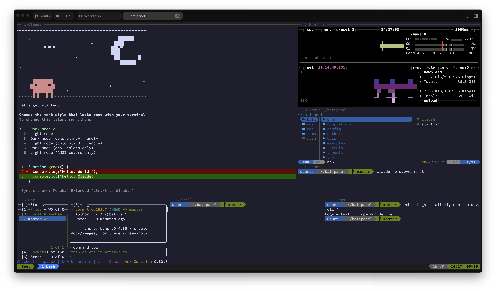
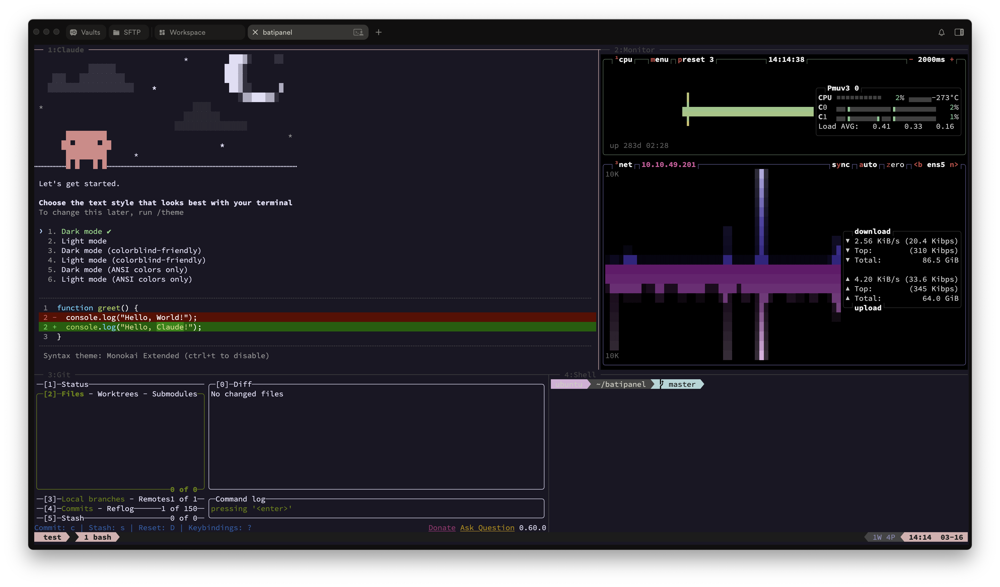
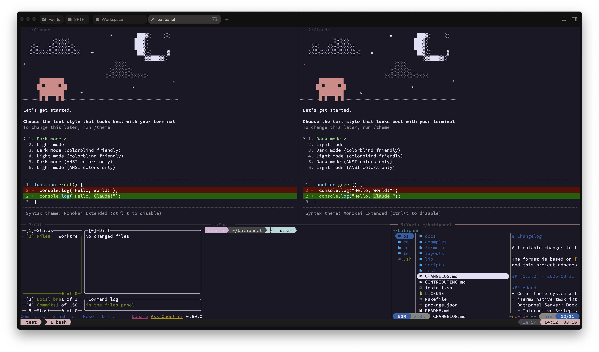
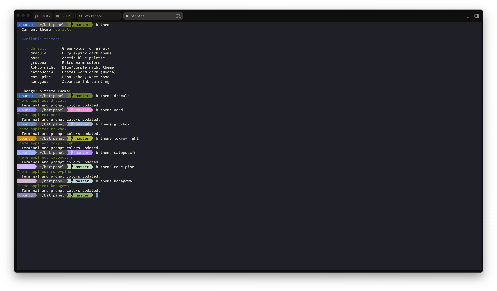

<p align="center">
  <strong>batipanel</strong> — AI-Powered Terminal Workspace Manager
  <br/>
  <a href="https://batipanel.com">Website</a> · <a href="https://batipanel.com/download">Desktop App</a> · <a href="https://github.com/batiai/batipanel/issues">Issues</a>
</p>

<p align="center">
  <a href="https://batipanel.com"></a>
</p>

<p align="center">
  <a href="https://github.com/batiai/batipanel/actions"></a>
  <a href="https://www.npmjs.com/package/batipanel"></a>
  <a href="https://github.com/batiai/batipanel/releases"></a>
  <a href="LICENSE"></a>
  
</p>

---

**One command. Full dev environment.** Install Claude Code, Git UI, system monitor, file browser — and manage them all as tmux sessions with a single keystroke.

```bash
curl -fsSL batipanel.com/install.sh | bash
```

<p align="center">
  
</p>

### What happens when you run this:

1. **Auto-installs everything** — tmux, Claude Code, lazygit, btop, yazi, eza (+ Nerd Font on macOS)
2. **Configures your terminal** — themed prompt, powerline glyphs, color scheme
3. **One command to start** — `b myproject` launches a multi-panel workspace
4. **Session persistence** — SSH drops? Terminal closed? `b myproject` brings it all back.

<p align="center">
  <a href="docs/images/layout-7panel.png"></a>
  <a href="docs/images/layout-4panel.png"></a>
  <a href="docs/images/layout-dual-claude.png"></a>
</p>
<p align="center">
  <sub>7panel (default) · 4panel (laptop) · dual-claude (multi AI) — click to enlarge</sub>
</p>

<p align="center">
  <a href="docs/images/themes-all.png"></a>
</p>
<p align="center">
  <sub>8 built-in themes — <code>b theme dracula</code> to switch</sub>
</p>

## Quick Start

```bash
# Install (pick one)
curl -fsSL https://batipanel.com/install.sh | bash   # Recommended
npm install -g batipanel                              # npm
npx batipanel                                         # npx (no install)

# Start your workspace
b myproject
```

---

## Key Features

| | |
|---|---|
| **All-in-one install** | One command sets up Claude Code + 5 dev tools + terminal theme. No manual config. |
| **Session management** | `b start`, `b stop`, `b ls` — manage workspaces like containers. Persistent across disconnects. |
| **8 layouts** | From 4-panel laptop to 8-panel ultrawide. Switch with `b myproject --layout 6panel`. |
| **8 color themes** | Dracula, Nord, Gruvbox, Tokyo Night, Catppuccin, Rose Pine, Kanagawa. Live reload with `b theme`. |
| **Smart fallbacks** | Every tool has a fallback. No btop? Uses htop. No htop? Uses top. Nothing breaks. |
| **Cross-platform** | macOS (Terminal.app, iTerm2) + Linux (Ubuntu, Amazon Linux, CentOS) + WSL. |

---

## Layouts

```bash
b myproject                     # use default layout
b myproject --layout 6panel     # use specific layout
b config layout dual-claude     # change default
```

| Layout | Panels | Best For |
|--------|--------|----------|
| `7panel` *(default)* | 7 | AI coding + external monitor |
| `4panel` | 4 | Laptops (13-14") |
| `5panel` | 5 | Balanced workspace |
| `6panel` | 6 | General dev + large monitor |
| `7panel_log` | 7 | Full-width log bar |
| `8panel` | 8 | Dual Claude + monitoring |
| `dual-claude` | 7 | Multi AI agent + ultrawide |
| `devops` | 5 | Docker / K8s operations |

<details>
<summary><b>Layout diagrams</b></summary>

### 7panel (default)

```
┌────────────────────────────────┬──────────────┐
│                                │ btop         │
│  claude (main workspace)       ├──────────────┤
│  55% width, 70% height        │ file tree    │
│                                ├──────────────┤
│                                │ remote-ctrl  │
├───────────┬────────────────────┴──────────────┤
│ lazygit   │ terminal         │ logs/server    │
└───────────┴──────────────────┴────────────────┘
```

### 4panel

```
┌────────────────────────┬──────────────────┐
│  claude (main)         │  btop            │
├────────────────────────┼──────────────────┤
│  lazygit               │  terminal        │
└────────────────────────┴──────────────────┘
```

### 6panel

```
┌──────────────┬───────────────┬────────────────┐
│ remote-ctrl  │ claude        │ btop           │
├──────────────┼───────────────┼────────────────┤
│ lazygit      │ terminal      │ file tree      │
└──────────────┴───────────────┴────────────────┘
```

### dual-claude

```
┌──────────────────┬──────────────────┐
│  claude #1       │  claude #2       │
│  (main)          │  (secondary)     │
├──────────┬───────┴──────┬───────────┤
│ lazygit  │  terminal    │ file mgr  │
└──────────┴──────────────┴───────────┘
```

### devops

```
┌──────────────────┬──────────────────┐
│  claude          │  btop            │
├──────────────────┼──────────────────┤
│  lazydocker      │  terminal        │
├──────────────────┴──────────────────┤
│  logs — full width (docker logs)    │
└─────────────────────────────────────┘
```

### 5panel

```
┌──────────────────────────────┬──────────────┐
│  claude (main)               │  lazygit     │
├──────────────┬───────────────┼──────────────┤
│ remote-ctrl  │  terminal     │  file tree   │
└──────────────┴───────────────┴──────────────┘
```

### 7panel_log

```
┌───────────────────────┬──────────┬────────────┐
│  claude (main)        │ lazygit  │ btop       │
├──────────┬────────────┤          │            │
│ remote   │ terminal   ├──────────┤            │
│          │            │ file tree│            │
├──────────┴────────────┴──────────┴────────────┤
│  logs — full width (tail -f / npm run dev)    │
└───────────────────────────────────────────────┘
```

### 8panel

```
┌──────────────┬──────────────┬──────────────┐
│  claude #1   │  claude #2   │  btop        │
│  (main)      │  (secondary) │              │
│              │              ├──────────────┤
│              │              │  logs        │
├──────────────┴──────────────┼──────────────┤
│  lazygit                    │  file mgr    │
└─────────────────────────────┴──────────────┘
```

</details>

---

## Color Themes

```bash
b theme              # list all themes
b theme dracula      # apply a theme (live reload)
```

| Theme | Style |
|-------|-------|
| `default` | Green/blue — clean and balanced |
| `dracula` | Purple/pink dark theme |
| `nord` | Arctic blue palette |
| `gruvbox` | Retro warm colors |
| `tokyo-night` | Blue/purple night theme |
| `catppuccin` | Pastel warm dark (Mocha) |
| `rose-pine` | Warm rose, soho vibes |
| `kanagawa` | Japanese ink painting palette |

Themes apply to tmux status bar (Powerline arrows), window tabs, pane borders, and shell prompt. Persists across sessions.

---

## Commands

```bash
# Session
b myproject                        # start or resume
b myproject --layout 6panel        # start with specific layout
b stop myproject                   # stop session
b reload myproject                 # restart session

# Project
b new myproject ~/path/to/project  # register project
b ls                               # list sessions & projects

# Config
b config layout 7panel_log         # change default layout
b theme dracula                    # change color theme
b config iterm-cc on               # iTerm2 native integration

# System
b doctor                           # check system health
b layouts                          # show available layouts
b help                             # show all commands

# AI Telegram Bot (Docker)
b server init                      # interactive setup
b server start                     # start server
b server stop                      # stop server
b server status                    # status + security report
```

---

## Keyboard Shortcuts

| Shortcut | Action |
|----------|--------|
| **Alt + h/j/k/l** | Move between panels (vim-style) |
| **Alt + Arrow Keys** | Move between panels |
| **Alt + f** | Zoom/focus current panel (toggle) |
| **Alt + Space** | Toggle last panel |
| **Alt + 1-9** | Switch to window by number |

<details>
<summary><b>All keyboard shortcuts</b></summary>

### Panel Management

| Shortcut | Action |
|----------|--------|
| **Alt + \\** | Split vertically |
| **Alt + -** | Split horizontally |
| **Alt + x** | Close current panel |
| **Alt + n** | New window |
| **Alt + [ / ]** | Previous / next window |

### Resizing

| Shortcut | Action |
|----------|--------|
| **Alt + Shift + Arrow** | Fine resize (1 unit) |
| **Prefix + Arrow** | Resize (5 units, prefix = Ctrl+B) |
| **Prefix + =** | Equalize all panels |
| **Mouse drag** | Drag panel borders |

### Swapping

| Shortcut | Action |
|----------|--------|
| **Alt + Shift + h/j/k/l** | Swap panel in direction |

### Copy Mode (vi-style)

| Shortcut | Action |
|----------|--------|
| **Prefix + [** | Enter copy mode |
| **v** | Begin selection |
| **Ctrl + v** | Rectangle selection |
| **y** | Copy to clipboard |
| **Escape** | Exit copy mode |

### Session

| Shortcut | Action |
|----------|--------|
| **Prefix + s** | List sessions |
| **Prefix + S** | New session |
| **Prefix + r** | Reload tmux config |

</details>

---

## Installation

<details>
<summary><b>macOS — step by step</b></summary>

1. Open Terminal (`Cmd + Space` → "Terminal")
2. Run:
   ```bash
   curl -fsSL https://batipanel.com/install.sh | bash
   ```
3. Type `b` to start

> **Alternatives**: `npx batipanel` (Node.js required) or `brew install batiai/tap/batipanel`

</details>

<details>
<summary><b>Linux / WSL — step by step</b></summary>

1. Open your terminal
2. Run:
   ```bash
   curl -fsSL https://batipanel.com/install.sh | bash
   ```
3. Type `b` to start

> **Alternatives**: `npx batipanel` or `git clone https://github.com/batiai/batipanel.git && cd batipanel && bash install.sh`

</details>

<details>
<summary><b>Windows (WSL2)</b></summary>

**Step 1**: Install WSL2 (PowerShell as Administrator):
```powershell
wsl --install
```

**Step 2**: Open **Windows Terminal** > **Ubuntu** tab:
```bash
curl -fsSL https://batipanel.com/install.sh | bash
```

**Step 3**: Type `b`

> **Tip**: Use [Windows Terminal](https://aka.ms/terminal) and go fullscreen (F11) for the best experience.

</details>

<details>
<summary><b>npm / Homebrew / manual</b></summary>

```bash
# npm — one-time run
npx batipanel

# npm — global install
npm install -g batipanel

# Homebrew
brew tap batiai/tap
brew install batipanel

# Manual
git clone https://github.com/batiai/batipanel.git
cd batipanel && bash install.sh
```

The installer auto-detects your package manager (apt, dnf, pacman, brew, port, nix, apk, zypper) and installs everything.

</details>

<details>
<summary><b>Upgrading / Uninstalling</b></summary>

```bash
# Upgrade
npm update -g batipanel          # npm
brew upgrade batipanel            # Homebrew
cd batipanel && git pull && bash install.sh  # manual

# Uninstall
npm uninstall -g batipanel        # npm
brew uninstall batipanel          # Homebrew
bash uninstall.sh                 # manual
```

Your projects and settings are always preserved during upgrades.

</details>

---

## AI Telegram Bot (OpenClaw) — Experimental

> **Note:** This feature is experimental and under active development. API and configuration may change.

Deploy a personal AI bot in an isolated Docker environment with one command.

```bash
b server init     # 3-step setup wizard (bot token, AI model, user ID)
b server start    # start Docker server — done!
```

- **Zero extra cost** for Claude Max subscribers ($200/mo) — OpenClaw gateway uses your existing session
- **5-layer Docker isolation** — read-only filesystem, network loopback, Telegram allowlist, sandboxed tool execution
- Full AI agent capabilities via Telegram: web search, PDF analysis, code execution, report generation

<details>
<summary><b>Server commands & security details</b></summary>

```bash
b server init       # interactive setup wizard
b server start      # start the Docker server
b server stop       # stop the server
b server status     # status + security report
b server logs [-f]  # view logs
b server update     # pull latest image & restart
b server config     # view config (secrets masked)
```

| Security Layer | Protection |
|----------------|-----------|
| **Container** | Read-only filesystem, dropped Linux capabilities |
| **Sandbox** | Tool execution in separate containers |
| **Network** | Loopback binding only (not exposed to LAN) |
| **Access** | Telegram allowlist (only your user ID) |
| **Credentials** | File permissions 600, gateway token auto-generated |

</details>

---

## Requirements

| Tool | Required? | Notes |
|------|-----------|-------|
| **tmux** | Yes | Auto-installed |
| **Claude Code** | Recommended | `curl -fsSL https://claude.ai/install.sh \| bash` |
| lazygit | Optional | Git UI (fallback: `git status`) |
| btop | Optional | Monitor (fallback: htop → top) |
| yazi | Optional | File manager (fallback: eza → tree) |
| Docker | Optional | Only for `b server` (Telegram bot) |

All optional tools are auto-installed when possible. Missing tools gracefully fallback to simpler alternatives.

---

## Platform Support

| Platform | Status | Terminals Tested |
|----------|--------|------------------|
| **macOS** | Stable | Terminal.app, iTerm2 |
| **Ubuntu/Debian** | Stable | GNOME Terminal, default terminal |
| **Amazon Linux / CentOS** | Beta | default terminal (tmux 2.6+ required, auto-installed) |
| **Windows** | Beta | Windows Terminal + WSL2 |
| Other Linux | Community | Alacritty, Kitty, WezTerm, xterm |

### macOS Terminal.app (built-in)

batipanel works out of the box with macOS's built-in Terminal. The installer automatically:

- Creates a dedicated **batipanel** Terminal profile (your original profile is untouched)
- Installs **Nerd Font** (MesloLGS NF) via Homebrew and sets it on the profile
- Applies **theme colors** (background, text, cursor)

All layouts, panels, keyboard shortcuts, 256-color themes, Powerline arrows, and session resume work fully.

> **Want true color (24-bit)?** Use [iTerm2](https://iterm2.com) for the richest color experience. Terminal.app supports 256 colors which covers all themes well.

### Linux

The installer auto-installs Nerd Font to `~/.local/share/fonts`. You may need to **select the font manually** in your terminal's preferences (look for "MesloLGS NF" or "MesloLGS Nerd Font").

On distributions with old tmux (e.g. Amazon Linux 2 ships 1.8), the installer will attempt to install tmux 3.x automatically.

<details>
<summary><b>Troubleshooting</b></summary>

**Panels look too small?** Try `b myproject --layout 4panel` or maximize your terminal.

**"tmux is not installed"?** Run `brew install tmux` (macOS) or `sudo apt install tmux` (Ubuntu).

**"claude CLI not installed"?** Run `curl -fsSL https://claude.ai/install.sh | bash`. Everything else still works without it.

**Powerline arrows showing as ">"?** Make sure your terminal font is set to a Nerd Font (e.g., MesloLGS NF). On macOS, the installer sets this automatically.

**WSL clipboard not working?** Run `sudo apt install xclip`.

**Navigation**: Use `Alt + h/j/k/l` to switch panels, `Alt + f` to zoom, mouse click to select.

</details>

---

## Documentation

| | |
|---|---|
| [Getting Started](docs/100-getting-started.md) | Install, first run, activation |
| [Usage Guide](docs/200-usage-guide.md) | Commands, sessions, project management |
| [Layouts & Panels](docs/300-layouts-panels.md) | 8 presets, panel types, customization |
| [Themes](docs/400-themes-appearance.md) | 8 color themes, fonts, prompt styling |
| [Configuration](docs/500-configuration.md) | config.sh, tmux.conf, env variables |
| [Supported Tools](docs/600-supported-tools.md) | Claude Code, lazygit, btop, yazi, eza |
| [Remote & SSH](docs/700-remote-ssh.md) | Server sessions, detach/reattach |
| [FAQ](docs/800-faq-troubleshooting.md) | Troubleshooting, platform-specific fixes |
| [Contributing](docs/900-contributing.md) | Dev setup, testing, PR guidelines |
| [Roadmap](docs/999-roadmap.md) | Planned features, what's next |

---

## Contributing

Contributions welcome! See [CONTRIBUTING.md](CONTRIBUTING.md) for details.

---

## License

[MIT](LICENSE) — Copyright (c) 2026 [bati.ai](https://bati.ai)

"batipanel" and the batipanel logo are trademarks of batiai. See [TRADEMARK.md](TRADEMARK.md) for details.

<p align="center">
  <a href="https://batipanel.com">batipanel.com</a> · Made by <a href="https://bati.ai">bati.ai</a>
</p>
